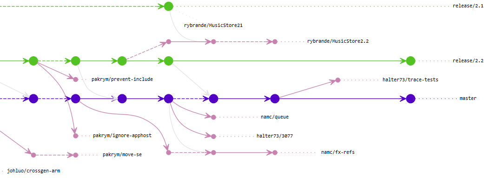

# Prigitsk

 

This is a tool that draws graphs of Git repositories. It uses dot.exe from GraphViz for rendering and loosely follows Flow branching strategy.
Currently available as a Windows console application,
with plans to create a web-based version.

## Usage

1. Download GraphViz. Either add its `bin` folder to PATH or run `prigitsk configure` to specify path to it.
2. Run from the directory of your Git repository:

   prigitsk draw

For options:

    prigitsk draw --help

## Example output

